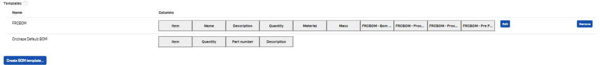

1. Open Onshape Classroom Admin
2. Go to Classroom settings
3. Go to Preferences
4. Look for the Bill of materials section
5. Create a new bom template called: `FRCBOM`
3. Add columns for the FRCBOM properties:
    - `Item`, `Name`, `Description`, `Quantity`, `Material`, `Mass`,`FRCBOM - Bom Material`,
      `FRCBOM - Pre Process`, `FRCBOM - Process 1`, `FRCBOM - Process 2`.
      