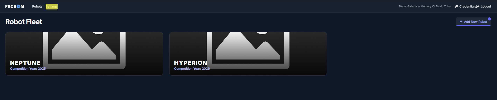
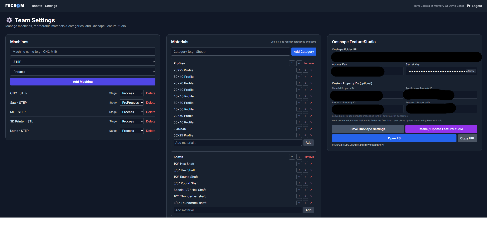
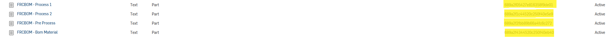

> These actions require an **Admin** login on frcbom.com.

### Machines & Materials

1. Go to **Team Settings**.  
2. Add **Materials** (simple list of material names your team uses).  
3. Add **Machines**, each with:
   - **name** (e.g., *CNC*, *3D Printer*, *Lathe*, *Gerung Saw*)  
   - **stage** — `"Process"` or `"PreProcess"`  
   - optional **cad_format** — preferred export (e.g., *STL*, *STEP*)

An example:

### Property IDs, folder link, and Admin API Keys

In **Team Settings** you’ll be prompted for:

- **Property IDs** — for the fields you created in Onshape.  
  Find these in **Onshape → Settings → Properties** (same page you created them). Copy their IDs into FRCBOM.
  - You'll see a list of a lot Properties, go to the bottom of the list where you see the ones we created:
  
- **Onshape folder link** — a link to an Onshape folder, where the FS Document will be stored 
- **Admin API Keys** — Create an Onshape API key pair (with all permissions) and paste into FRCBOM.

#### Create your Onshape API Keys

1. Open the **Onshape Developer Portal**: [API keys](https://cad.onshape.com/appstore/dev-portal).  
2. In the left pane, click **API keys**.  
3. Click **Create new API key**.  
4. **Select all permissions**.  
5. Click **Create API key** and copy both **Access Key** and **Secret Key** into FRCBOM settings.
