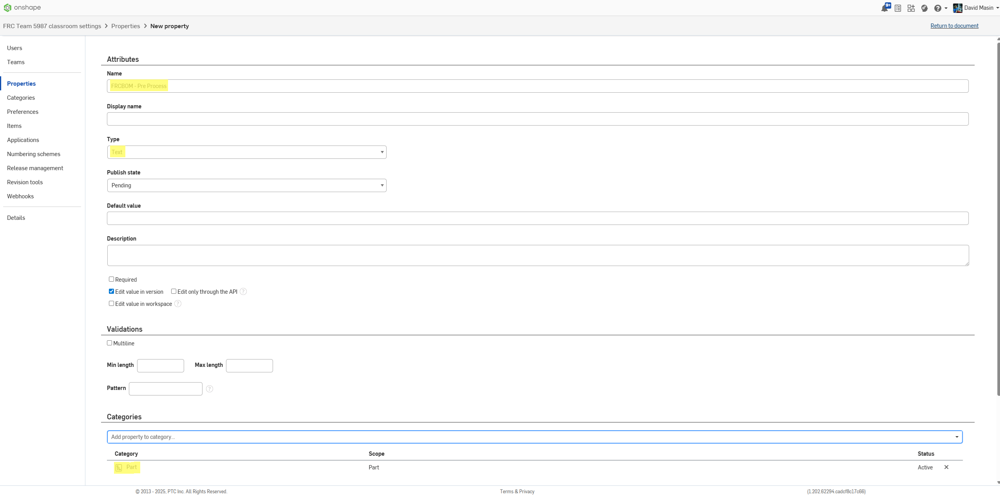

Create the following **custom properties** in **Onshape → Classroom Settings → Properties** (Your organization may name this “Company” or “Classroom”):

> Use **Text** type and attach to **Part**.

- **FRCBOM - Pre Process**  (Text, **Part**)
- **FRCBOM - Process 1**    (Text, **Part**)
- **FRCBOM - Process 2**    (Text, **Part**)
- **FRCBOM - Bom Material** (Text, **Part**)

An example for creating a property:

You will later copy the **Property IDs** from this page (Settings → Properties) into FRCBOM settings.
