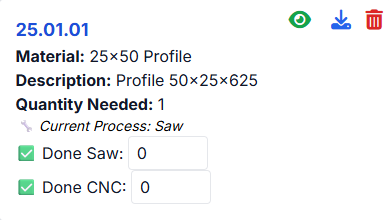
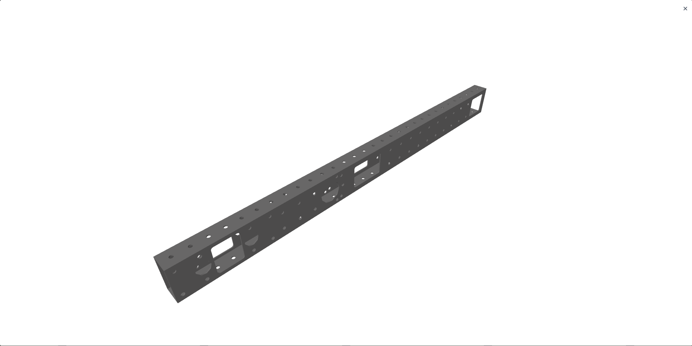

# ⬇️ Downloading CAD from FRCBOM

One of the most useful features of the FRCBOM site is the ability to **download CAD files directly from your BOM parts list**.  
This helps ensure every part is exported in the correct format for your machines.

---

## 📥 Where to Find the Download Button
- Navigate to your **Robot → System → BOM** page.
- Each part card will include:
    - An **eye icon 👁️** → preview the part in a 3D viewer.
    - A **download icon ⬇️** → download the part CAD.

---

## 📂 Download Formats
- The format depends on the **machine** set up in your Team Settings.
    - For example:
        - CNC → `.STEP`
        - 3D Printer → `.STL`
        - Lathe → `.STEP` (or whatever you configure)
- The file format is chosen automatically based on the **current or finished process** of that part.

---

## 🔄 Download Queue
When you download a part:
- A **queue panel** will appear in the top-right with a bell 🔔 icon.
- It shows:
    - Which parts are downloading.
    - ✅ Confirmation when each part finishes.

You can close/reopen the queue at any time.

---

## 📑 Download by Material
You can also bulk download all parts of a **specific material**:

1. In the BOM view, use the **“Download All Material”** dropdown.
2. Choose a material (e.g., Aluminum 6061).
3. All parts with that material will be queued and downloaded automatically.

---

## 🎥 Preview Before Download
- Clicking the **eye icon 👁️** on a part opens a **3D viewer** (powered by three.js).
- You can rotate, zoom, and inspect the model before exporting.

---

## 🛠️ Notes
- You must have provided a valid **Onshape API Key** in your Team Settings (Admin only).
- PartStudio URLs and Assembly URLs must be set up properly in the **System Settings** to enable CAD export.
- Downloads respect the **process status** of the part (Pre-Process, Process 1, Process 2).

---
